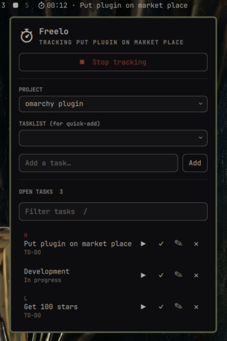

# Freelo (`hl.freelo`)

Omarchy bar widget for [Freelo](https://www.freelo.io/): time tracking, task
CRUD, and project switching without leaving the bar.

- Bar label shows the live-ticking elapsed time and task name while tracking
  is running, and just the icon otherwise
- Click the icon to open the panel: switch project/tasklist, quick-add a
  task, and browse/filter open tasks
- Per-task row actions: start tracking, finish, rename, delete
- Click a task row to open it in the browser



## Requirements

- [freelo-cli](https://github.com/freeloio/freelo-cli), installed and
  authenticated (`freelo auth login`) — this plugin shells out to it for
  every read and write, and never talks to Freelo's API directly
- `jq`

## Install

```bash
omarchy plugin add https://github.com/hlasensky/omarchy-freelo.git --enable
```

## How it works

The plugin ships `omarchy-freelo-refresh`, a bundled bash script that shells
out to `freelo-cli` and `jq` to aggregate projects/tasklists/tasks/tracking
status into one JSON payload. The Service.qml singleton invokes it directly
from the plugin directory it's part of this plugin, not a separately
installed dependency, and touches no credentials of its own (auth stays in
freelo-cli's own store).

## Configure

Refresh interval (10–300s, default 30s) is set through the Omarchy shell's
bar widget settings. It also refreshes on demand: open the panel and press
`r`, or right-click the bar icon.

## Remove

```bash
omarchy plugin remove hl.freelo
```

## License

[MIT](LICENSE)
